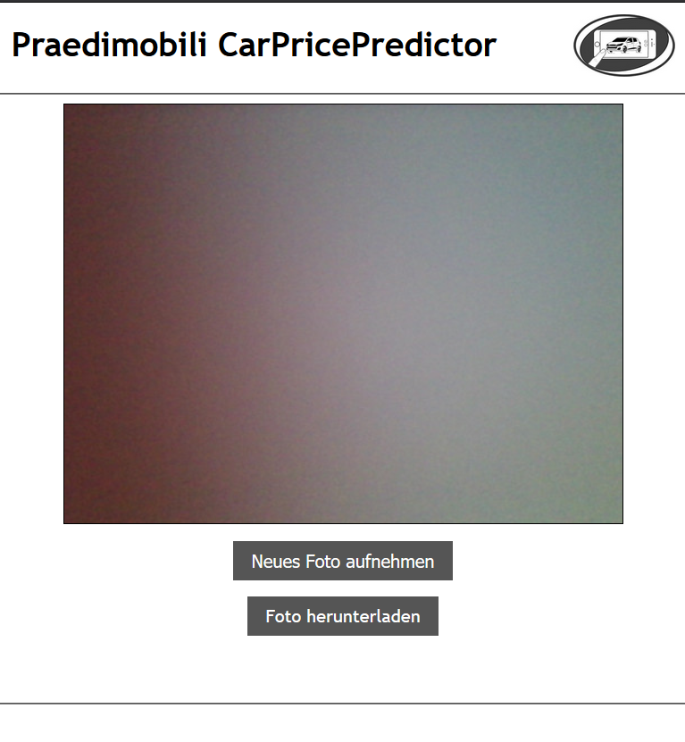

# CarPricePredictor - Predimobili

---

## 1. Summary

This project is part of the lecture Applied Artificial Intelligence at the University of Applied Sciences Esslingen.
The aim of this project is the automatic recognition of automobiles with machine learning, and the pricing of the vehicle based on them.

## 2. Project Description

### 2.1 Dependencies

- [NumPy](http://docs.scipy.org/doc/numpy-1.10.1/user/install.html)
- [Tensorflow](https://www.tensorflow.org/versions/r0.8/get_started/os_setup.html)
- [Keras](https://keras.io/#installation)
- [OpenCV](https://opencv-python-tutroals.readthedocs.io/en/latest/)

source of inspiration
https://github.com/foamliu/Car-Recognition

## 2. Contributors

##### Sven Habrock, David Le Duy, Marvin Gygas, Sebastian Späth, Sascha Lindner
